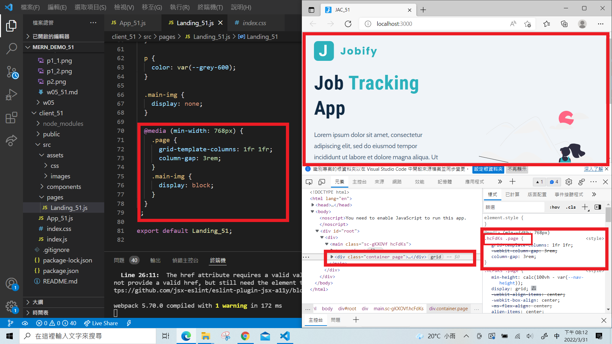
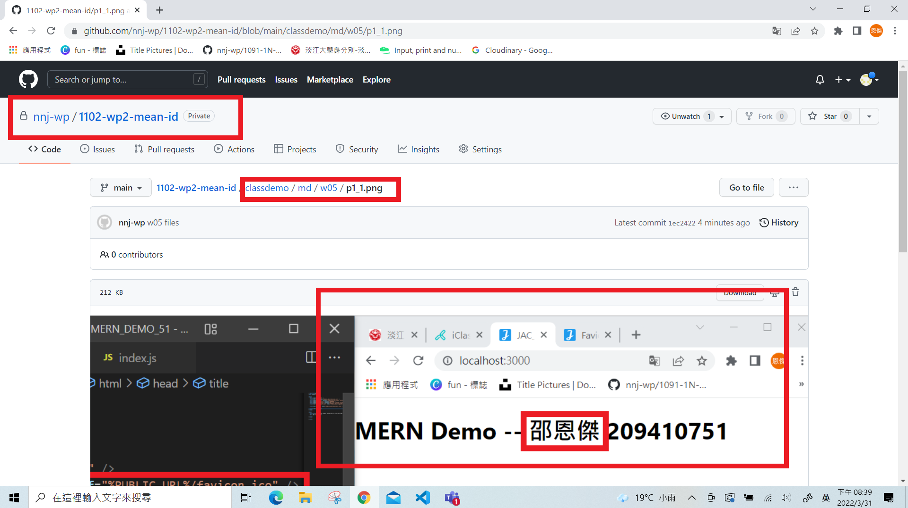
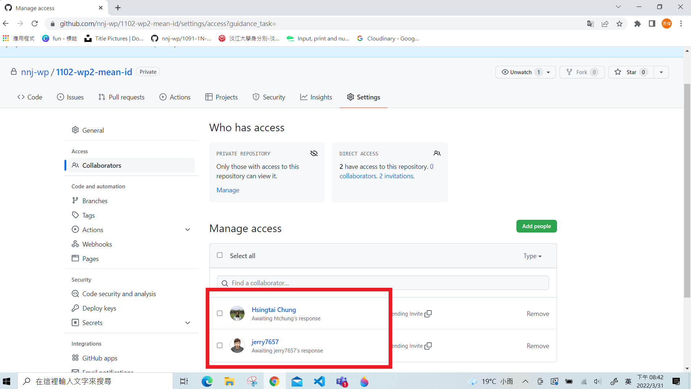

# Step 1: Initial Setup

### P1: P1: favicon & title using your English name initials

### P

# Step 2: Add Landing_xx using styled components

### P3: styled components demo (2 buttons)

### P4: Landing_xx styled components with Responsive Design

### P5: push w05 files to Github, and show w05_xx.md

### P6: Share your Github repo to htchung and jerry7657

