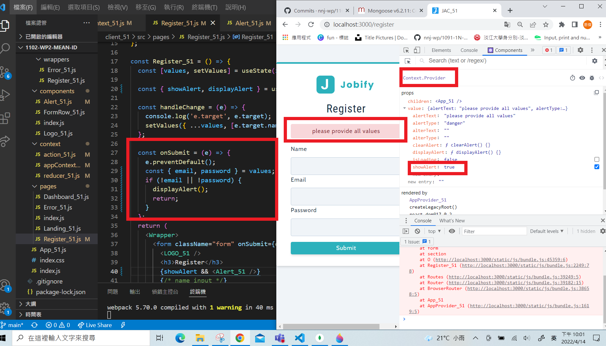

### W08-P1 create a express web server with route /

### W08-P2 connect MongoDB server

### W08-P3 Use MongoCompass to create database demo_xx and collection user, enter one document that has your name and sid

### W08-P4 displayAlert in Register_xx.js, show state in AppProvider_xx

### W08-P5 W08 step record

