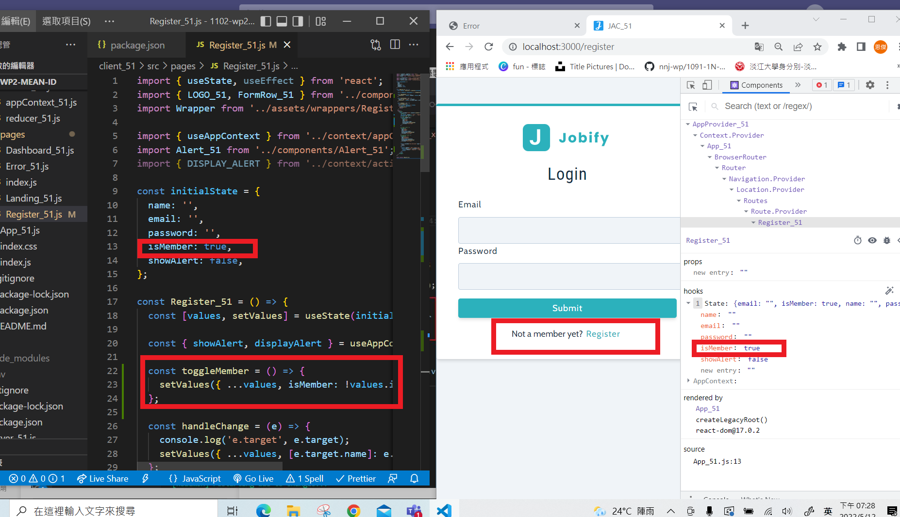

### w12-p1 switch Register and Login, and log




### w12-p2-1 test for notFoundMiddleware_xx.js


### w12-p2-2 test for errorHandlerMiddleware_xx.js


### w12-p4 Use postman to test route /api/v1/auth_xx/login_xx


### w12-p5 Use postman to test route /api/v1/auth_xx/updateUser_xx


### W12-LAST-LOG show all W12 log records in Github


```
$ git log --pretty=format:"%h%x09%an%x09%ad%x09%s" --after="2022-05-11"
408e422 nnj-wp  Thu May 12 22:08:56 2022 +0800  c
9563f77 nnj-wp  Thu May 12 22:08:00 2022 +0800  ### w12-p4 Use postman to test route /api/v1/auth_xx/login_xx
f203e98 nnj-wp  Thu May 12 20:16:31 2022 +0800  ### w12-p2-1 test for notFoundMiddleware_xx.js , and ### w12-p2-2 test for errorHandlerMiddleware_xx.js
95d89b8 nnj-wp  Thu May 12 19:46:02 2022 +0800  ### w12-p1 switch Register and Login, and log
```
